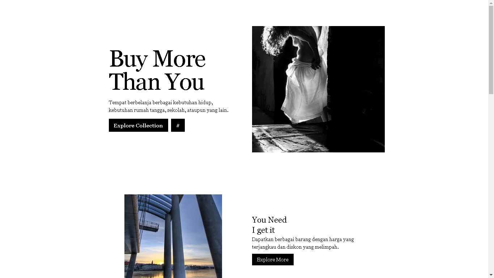
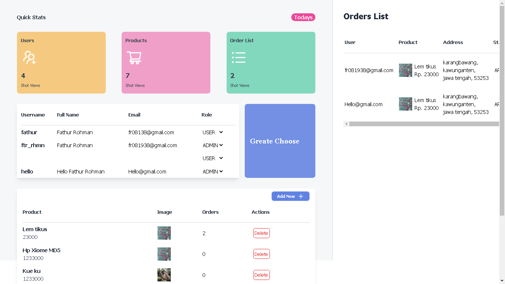
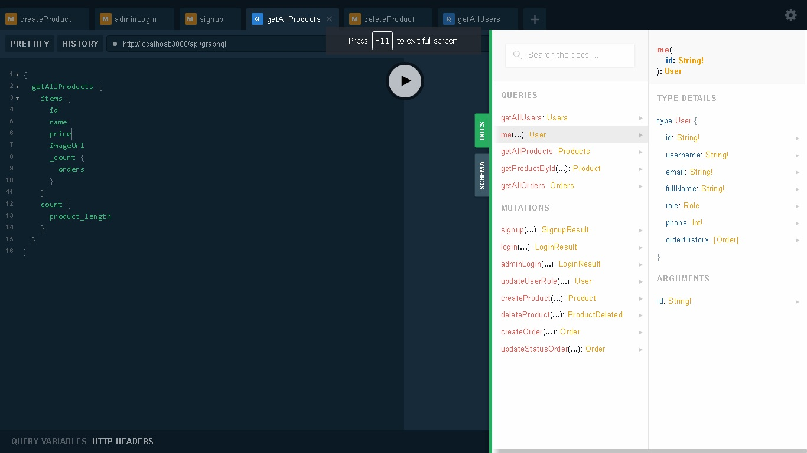

# Delive - Delivered shop system with GraphQL
Build with Next js and Prisma

<p float="left">

  

  

  

</p>

## Feature Application

### Admin
- Create/Delete Products
- Edit User Role
- Update Orders

### Client
- Login/Register/AdminLogin Authentication
- Delivered a product
- Shipping Address

## Technology 

### Client
- Next js
- Tailwindcss
- @apollo/client
- react-hot-toast

### Server
- apollo-server-micro
- Prisma
- PostgresQL
- brypt
- cloudinary

## Usage

First, run the development server:

```bash
npm run dev
# or
yarn dev
```

Open [http://localhost:3000](http://localhost:3000) with your browser to see the result.

